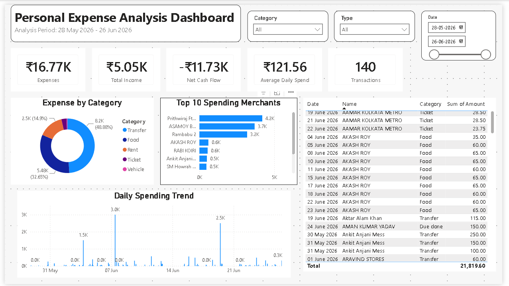

# Personal Expense Analysis Dashboard

An interactive Power BI dashboard built to analyze personal UPI transactions and understand spending behavior over a 30-day period.

## Project Overview

This project analyzes personal transaction data to identify where money is being spent, track income versus expenses, and uncover spending patterns across categories, merchants, and dates.

The dashboard converts raw transaction records containing date, recipient name, transaction type, amount, and category into clear financial insights.

## Dashboard Preview



## Key KPIs

- Total Expenses
- Total Income
- Net Cash Flow
- Average Daily Spend
- Total Number of Transactions

## Dashboard Visualizations

- **Expense Distribution by Category**  
  Shows how total expenses are distributed across categories such as Food, Shopping, Transport, Bills, Transfers, and others.

- **Top 10 Spending Merchants**  
  Identifies the merchants or recipients with the highest total spending.

- **Daily Spending Trend**  
  Tracks daily expense patterns and highlights high-spending days.

- **Interactive Filters**  
  Allows users to filter the dashboard by category, transaction type, and date range.

## Tools Used

- Microsoft Power BI
- Google Sheets
- DAX
- PhonePe transaction statement data

## Data Preparation

The raw transaction data included the following fields:

| Column | Description |
|---|---|
| Date | Transaction date |
| Name | Merchant, recipient, or phone number |
| Type | Debit or Credit |
| Amount | Transaction amount |
| Category | Manually assigned spending category |

To make the data analysis-ready:

- Debit transactions were treated as expenses.
- Credit transactions were treated as income or refunds.
- Merchants and recipients were manually categorized.
- Unknown personal payments were categorized as Transfers.
- Sensitive personal details were excluded from the public repository.

## DAX Measures Used

```DAX
Total Expense =
CALCULATE(
    SUM(Transactions[Amount]),
    Transactions[Type] = "Debit"
)
Total Income =
CALCULATE(
    SUM(Transactions[Amount]),
    Transactions[Type] = "Credit"
)
Net Cash Flow =
[Total Income] - [Total Expense]
Total Transactions =
COUNTROWS(Transactions)
Average Daily Spend =
DIVIDE(
    [Total Expense],
    DISTINCTCOUNT(Transactions[Date])
)
